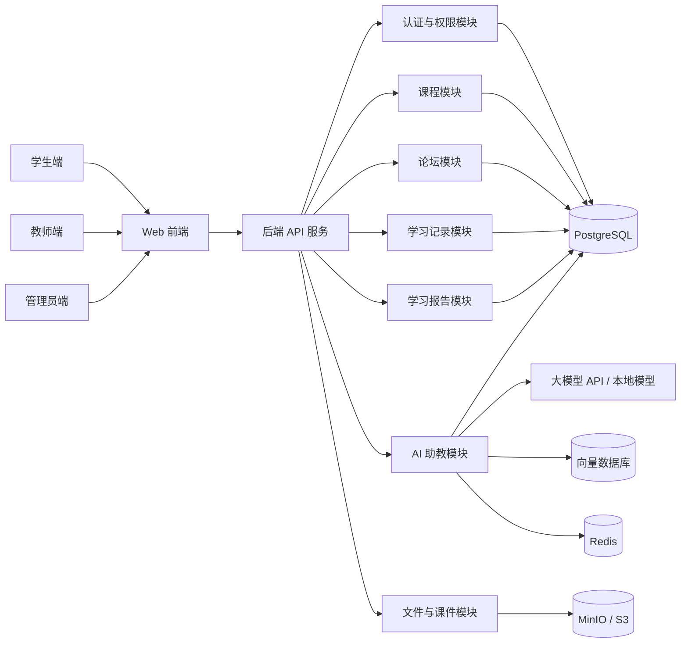
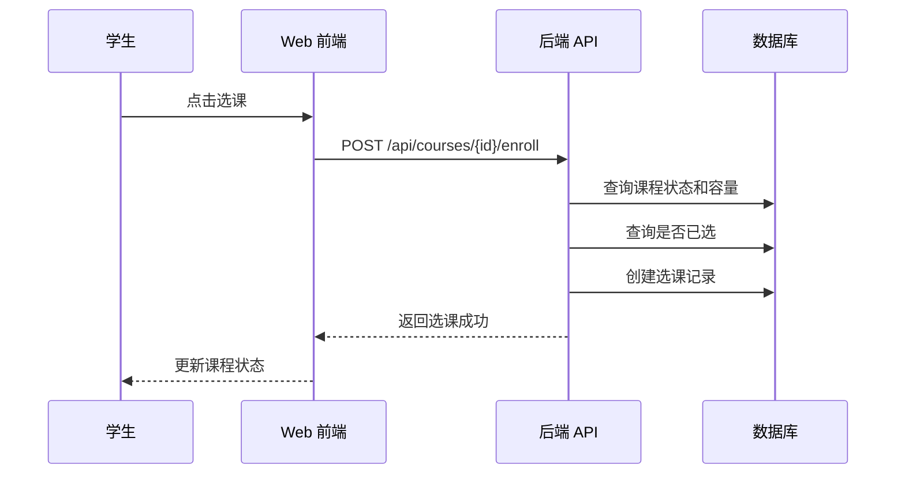
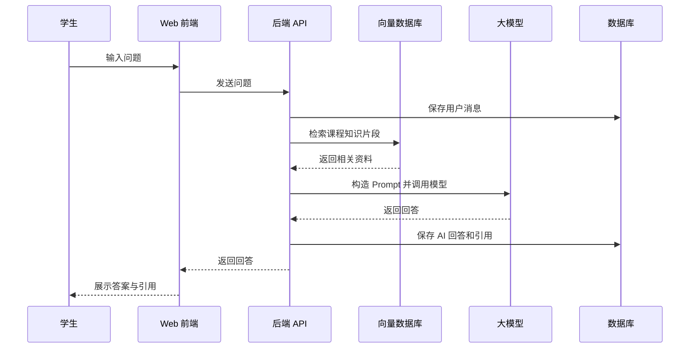

# 智能伴学系统平台架构设计说明

本文档面向 `guochuang` 项目，用来说明一个面向师生教学场景的智能伴学系统应该采用什么架构、为什么这样选，以及落到本项目时目录和模块应该如何组织。

项目目标可以概括为：围绕“课程学习 + 师生互动 + AI 助教 + 学习记录分析”建设一个可持续扩展的平台。第一阶段可以包含登录系统、论坛交流、课程选择、AI 助教问答、学习报告记录；后续可以继续拓展作业批改、知识图谱、推荐系统、班级管理、考试测评、数据看板等能力。

## 1. 推荐结论

建议采用：

> 前后端分离 + 模块化单体后端 + 清晰分层架构 + AI 能力独立边界 + Monorepo 项目组织

也就是说，项目一开始不建议直接做复杂微服务。更合适的路线是先用“模块化单体”把业务边界划清楚，等用户量、团队规模、部署压力或 AI 服务负载上来之后，再把个别模块拆成独立服务。

推荐形态：

```text
Web 前端
  |
  | HTTPS / REST API / SSE
  v
后端 API 服务（模块化单体）
  |
  | 调用
  v
AI 助教服务边界（可以先在同一后端中实现，后期可独立部署）
  |
  +--> 关系型数据库 PostgreSQL / MySQL
  +--> Redis 缓存与任务队列
  +--> 向量数据库 pgvector / Qdrant / Milvus
  +--> 对象存储 MinIO / S3，用于课件、图片、附件
```

## 2. 为什么不一开始就上微服务

这个项目未来功能会很多，但早期最重要的是快速建立完整闭环：用户能登录、选课、交流、问 AI、查看学习记录。微服务会带来服务注册、链路追踪、网关、分布式事务、部署编排、日志聚合等额外成本，对早期开发并不划算。

模块化单体的优点：

- 开发速度快，适合课程项目、国创项目、原型验证和早期产品。
- 代码边界清晰，每个模块可以独立维护。
- 部署简单，一个后端服务即可运行主要业务。
- 未来可演进，某些模块成熟后可以拆成独立微服务。
- 数据一致性更容易保障，减少早期分布式系统复杂度。

适合未来拆出去的模块：

- `ai-assistant`：AI 助教调用大模型、RAG 检索、知识库问答，可能计算压力大。
- `notification`：站内信、邮件、短信、微信通知。
- `analytics`：学习行为分析、报表统计、推荐模型。
- `file`：文件上传、转码、课件解析。

## 3. 推荐技术栈

如果团队没有强制技术栈，建议选择下面这一套，比较适合“教学平台 + AI 功能”。

### 3.1 前端

推荐：

- Vue 3 + TypeScript + Vite
- Pinia 状态管理
- Vue Router
- Element Plus / Naive UI 作为组件库
- Axios / Fetch 封装 API 请求
- Markdown 渲染用于 AI 回答、课程说明、论坛内容

选择 Vue 的原因是学习成本较低、中文资料多、适合学生团队快速协作。如果团队更熟 React，也可以用 React + TypeScript + Vite + Ant Design，整体架构不变。

### 3.2 后端

推荐方案 A：

- Python FastAPI
- SQLAlchemy / SQLModel
- Alembic 数据库迁移
- Pydantic 数据校验
- Celery / RQ 处理异步任务

优点：和 AI、大模型、RAG、向量数据库生态结合非常方便。

推荐方案 B：

- Java Spring Boot
- Spring Security
- MyBatis-Plus / JPA
- Spring Task / MQ

优点：企业级生态成熟，适合偏工程规范、偏 Java 教学环境的团队。

本项目如果重点在 AI 助教和智能分析，推荐优先使用 FastAPI；如果团队已有 Java 基础，也可以采用 Spring Boot 主后端 + Python AI 服务的组合。

### 3.3 数据层

推荐：

- PostgreSQL：主数据库，保存用户、课程、论坛、学习记录等结构化数据。
- Redis：登录状态、验证码、热点缓存、限流、异步任务中间件。
- pgvector / Qdrant / Milvus：保存课件、教材、问答资料的向量，用于 AI 知识库检索。
- MinIO / S3：保存课件、头像、附件、报告文件。

如果早期部署想简单，可以先用 PostgreSQL + pgvector，把关系数据和向量数据放在同一个数据库里；后期数据量大了再迁移到 Qdrant 或 Milvus。

## 4. 整体架构图



## 5. 后端分层架构

后端建议采用清晰分层，而不是把所有逻辑写在 Controller 或 Router 里。

推荐分层：

```text
接口层 API / Controller
  负责接收请求、参数校验、返回响应

应用层 Application / Service
  负责编排业务流程，例如选课、发帖、生成报告、调用 AI

领域层 Domain
  负责核心业务规则，例如用户角色、课程容量、选课状态、帖子状态

基础设施层 Infrastructure
  负责数据库、缓存、文件存储、大模型调用、向量检索等外部技术细节
```

对应代码依赖关系：

```text
API 层 --> Application 层 --> Domain 层
Application 层 --> Infrastructure 接口
Infrastructure 实现具体数据库、Redis、LLM、对象存储
```

好处：

- 业务逻辑不会散落在接口文件中。
- 更容易测试核心逻辑。
- 将来替换数据库、AI 模型或对象存储时，不需要大规模改业务代码。
- 模块边界清楚，便于团队分工。

## 6. 项目目录建议

建议 `guochuang` 采用 Monorepo，也就是前端、后端、文档、部署文件都放在同一个项目仓库里。

```text
guochuang/
├── ARCHITECTURE.md
├── README.md
├── docs/
│   ├── product-requirements.md
│   ├── api-design.md
│   ├── database-design.md
│   ├── ai-assistant-design.md
│   └── deployment.md
├── apps/
│   ├── web/
│   │   ├── src/
│   │   │   ├── app/
│   │   │   ├── pages/
│   │   │   ├── components/
│   │   │   ├── features/
│   │   │   ├── shared/
│   │   │   └── api/
│   │   ├── package.json
│   │   └── vite.config.ts
│   └── api/
│       ├── app/
│       │   ├── main.py
│       │   ├── core/
│       │   ├── modules/
│       │   ├── common/
│       │   ├── infrastructure/
│       │   └── tests/
│       ├── migrations/
│       ├── pyproject.toml
│       └── alembic.ini
├── packages/
│   └── shared-types/
├── scripts/
├── deploy/
│   ├── docker-compose.yml
│   ├── nginx/
│   └── env.example
└── data/
    ├── seed/
    └── knowledge-base/
```

如果后端选择 Spring Boot，可以把 `apps/api/app` 换成：

```text
apps/api/
├── src/main/java/com/guochuang/learning/
│   ├── GuochuangApplication.java
│   ├── common/
│   ├── config/
│   ├── modules/
│   └── infrastructure/
└── src/test/java/com/guochuang/learning/
```

## 7. 后端模块拆分

建议在后端中按业务能力拆模块，而不是按技术类型简单堆文件。

```text
apps/api/app/modules/
├── auth/
│   ├── api.py
│   ├── schemas.py
│   ├── service.py
│   ├── models.py
│   └── repository.py
├── users/
├── courses/
├── enrollments/
├── forum/
├── assistant/
├── learning_records/
├── reports/
├── files/
└── notifications/
```

每个模块内部建议包含：

- `api.py`：接口路由。
- `schemas.py`：请求和响应 DTO。
- `service.py`：应用服务，负责编排业务流程。
- `models.py`：数据库模型或领域实体。
- `repository.py`：数据库访问封装。
- `permissions.py`：模块权限规则，可选。
- `tests/`：模块测试，可选。

示例：

```text
modules/courses/
├── api.py
├── schemas.py
├── service.py
├── models.py
├── repository.py
└── tests/
```

## 8. 前端模块拆分

前端建议按照“页面 + 功能模块 + 通用能力”组织。

```text
apps/web/src/
├── app/
│   ├── router.ts
│   ├── store.ts
│   └── providers.ts
├── pages/
│   ├── LoginPage.vue
│   ├── DashboardPage.vue
│   ├── CourseListPage.vue
│   ├── CourseDetailPage.vue
│   ├── ForumPage.vue
│   ├── AssistantPage.vue
│   └── LearningReportPage.vue
├── features/
│   ├── auth/
│   ├── courses/
│   ├── forum/
│   ├── assistant/
│   └── reports/
├── components/
│   ├── AppLayout.vue
│   ├── UserMenu.vue
│   ├── CourseCard.vue
│   └── MarkdownRenderer.vue
├── shared/
│   ├── utils/
│   ├── hooks/
│   ├── constants/
│   └── types/
└── api/
    ├── client.ts
    ├── auth.ts
    ├── courses.ts
    ├── forum.ts
    ├── assistant.ts
    └── reports.ts
```

页面建议围绕用户任务设计：

- 学生：首页、我的课程、课程详情、AI 助教、论坛、学习报告。
- 教师：课程管理、学生学习情况、论坛答疑、知识库上传、报告查看。
- 管理员：用户管理、角色权限、系统配置、数据统计。

## 9. 核心业务模块设计

### 9.1 登录与权限系统

核心能力：

- 用户注册和登录。
- 支持学生、教师、管理员三类角色。
- JWT / Session 认证。
- 密码加密存储。
- 权限控制到接口级别和页面级别。

核心实体：

```text
User
- id
- username
- email
- password_hash
- role
- avatar_url
- status
- created_at

Role
- id
- code
- name

Permission
- id
- code
- name
```

早期可以只用 `User.role` 简化处理，后期再扩展成完整 RBAC。

### 9.2 课程选择系统

核心能力：

- 学生浏览课程。
- 学生选课、退课。
- 教师发布课程、编辑课程。
- 课程容量限制。
- 课程资料上传。
- 课程章节管理。

核心实体：

```text
Course
- id
- title
- description
- teacher_id
- cover_url
- capacity
- status
- created_at

CourseChapter
- id
- course_id
- title
- sort_order

CourseMaterial
- id
- course_id
- chapter_id
- file_url
- file_type
- parsed_text_status

Enrollment
- id
- course_id
- student_id
- status
- enrolled_at
```

选课时要注意：

- 一个学生不能重复选择同一门课程。
- 已满员课程不能继续选。
- 已下架课程不能被选择。
- 教师不能作为学生选择自己教授的课程，除非业务允许。

### 9.3 论坛交流系统

核心能力：

- 课程内论坛或全站论坛。
- 发帖、回帖、点赞、收藏。
- 教师置顶、加精、关闭帖子。
- AI 可以基于帖子内容辅助生成回复建议。

核心实体：

```text
ForumPost
- id
- course_id
- author_id
- title
- content
- status
- is_pinned
- created_at

ForumReply
- id
- post_id
- author_id
- content
- parent_reply_id
- created_at

ForumReaction
- id
- target_type
- target_id
- user_id
- reaction_type
```

### 9.4 AI 助教智能问答

AI 助教是本项目的关键特色，建议从一开始就把它作为独立业务边界设计。

核心能力：

- 学生提问，AI 根据课程资料回答。
- 回答中尽量引用课程材料来源。
- 教师可以上传知识库资料。
- 支持多轮对话。
- 支持保存问答记录。
- 支持对回答点赞、点踩和反馈。

推荐采用 RAG 架构：

```text
用户问题
  |
  v
问题改写 / 意图识别
  |
  v
向量检索课程资料、讲义、FAQ、论坛精选回答
  |
  v
构造提示词 Prompt
  |
  v
调用大模型
  |
  v
生成带引用的回答
  |
  v
保存对话记录与学习行为
```

AI 模块内部可以拆成：

```text
modules/assistant/
├── api.py
├── schemas.py
├── chat_service.py
├── retrieval_service.py
├── prompt_builder.py
├── llm_client.py
├── knowledge_ingestion.py
├── models.py
└── repository.py
```

核心实体：

```text
AssistantSession
- id
- user_id
- course_id
- title
- created_at

AssistantMessage
- id
- session_id
- role
- content
- citations
- created_at

KnowledgeDocument
- id
- course_id
- title
- source_type
- source_url
- parse_status
- created_at

KnowledgeChunk
- id
- document_id
- content
- embedding_id
- chunk_index
```

建议加入的安全策略：

- 限制 AI 只回答与课程相关的问题。
- 对上传资料做解析状态检查。
- 对大模型输出做敏感内容过滤。
- 对每个用户设置调用频率限制。
- 保存用户反馈，用于后续优化。

### 9.5 学习记录与报告

核心能力：

- 记录学生浏览课程、观看资料、提问、发帖、回帖、完成任务等行为。
- 根据学习行为生成周报、月报或课程报告。
- 教师可以查看班级整体学习情况。
- 学生可以看到自己的学习趋势和薄弱知识点。

核心实体：

```text
LearningEvent
- id
- user_id
- course_id
- event_type
- event_payload
- created_at

LearningProgress
- id
- user_id
- course_id
- chapter_id
- progress_percent
- last_accessed_at

LearningReport
- id
- user_id
- course_id
- report_type
- summary
- metrics
- suggestions
- generated_at
```

报告生成可以先做规则统计：

- 登录次数。
- 学习时长。
- 浏览章节数量。
- 提问次数。
- 论坛互动次数。
- 课程完成率。

后期再加入 AI 生成总结：

```text
统计数据 + 最近学习行为 + 课程目标 + AI Prompt -> 个性化学习建议
```

## 10. 数据库设计原则

建议遵循以下原则：

- 每张表都使用 `id` 主键。
- 关键表都包含 `created_at`、`updated_at`。
- 不直接删除重要业务数据，优先使用 `status` 或 `deleted_at`。
- 用户输入内容保留原文，同时可以存储清洗后的版本。
- 学习行为日志尽量追加写入，不频繁更新。
- 大文本、文件、图片不要直接放入数据库，存储文件 URL 或对象存储 key。

早期数据库表可以按下面顺序建立：

```text
users
courses
course_chapters
course_materials
enrollments
forum_posts
forum_replies
assistant_sessions
assistant_messages
knowledge_documents
knowledge_chunks
learning_events
learning_progress
learning_reports
```

## 11. API 设计建议

REST API 路径建议：

```text
POST   /api/auth/login
POST   /api/auth/register
GET    /api/users/me

GET    /api/courses
POST   /api/courses
GET    /api/courses/{course_id}
PUT    /api/courses/{course_id}
POST   /api/courses/{course_id}/enroll
DELETE /api/courses/{course_id}/enroll

GET    /api/courses/{course_id}/posts
POST   /api/courses/{course_id}/posts
GET    /api/posts/{post_id}
POST   /api/posts/{post_id}/replies

POST   /api/assistant/sessions
GET    /api/assistant/sessions
GET    /api/assistant/sessions/{session_id}/messages
POST   /api/assistant/sessions/{session_id}/messages

GET    /api/reports/me
POST   /api/reports/generate
GET    /api/courses/{course_id}/analytics
```

统一响应格式建议：

```json
{
  "success": true,
  "data": {},
  "message": "ok",
  "request_id": "..."
}
```

错误响应建议：

```json
{
  "success": false,
  "error": {
    "code": "COURSE_FULL",
    "message": "课程人数已满"
  },
  "request_id": "..."
}
```

## 12. AI 助教接口建议

普通非流式问答：

```text
POST /api/assistant/sessions/{session_id}/messages
```

请求：

```json
{
  "course_id": "course_001",
  "content": "请解释一下这节课里的梯度下降",
  "use_course_knowledge": true
}
```

响应：

```json
{
  "answer": "梯度下降是一种...",
  "citations": [
    {
      "document_id": "doc_001",
      "title": "第 3 章 机器学习基础",
      "chunk_index": 5
    }
  ]
}
```

如果希望 AI 回答像 ChatGPT 一样逐字出现，建议使用 SSE：

```text
POST /api/assistant/sessions/{session_id}/messages/stream
```

前端使用 `EventSource` 或 `fetch` 流式读取。

## 13. 权限模型

建议第一阶段使用三种角色：

```text
student
teacher
admin
```

权限示例：

| 功能 | 学生 | 教师 | 管理员 |
|---|---:|---:|---:|
| 浏览课程 | 是 | 是 | 是 |
| 选择课程 | 是 | 否 | 否 |
| 创建课程 | 否 | 是 | 是 |
| 上传课件 | 否 | 是 | 是 |
| 论坛发帖 | 是 | 是 | 是 |
| 删除任意帖子 | 否 | 课程教师可管理 | 是 |
| 使用 AI 助教 | 是 | 是 | 是 |
| 查看个人报告 | 是 | 是 | 是 |
| 查看班级报告 | 否 | 是 | 是 |
| 管理用户 | 否 | 否 | 是 |

## 14. 典型业务流程

### 14.1 学生选课流程



### 14.2 AI 课程问答流程



## 15. 开发阶段规划

### 第一阶段：最小可用版本

目标是让平台跑通主流程。

- 登录、注册、角色区分。
- 课程列表、课程详情、教师创建课程。
- 学生选课。
- 课程论坛发帖和回帖。
- AI 助教基础问答，可以先不接知识库，只调用模型。
- 学习行为记录基础表。

### 第二阶段：教学闭环版本

目标是让系统真正服务教学。

- 教师上传课件。
- 课件解析为文本。
- 建立课程知识库。
- AI 助教基于课程资料回答问题。
- 学生个人学习报告。
- 教师查看课程学习概览。

### 第三阶段：智能增强版本

目标是体现“智能伴学”的特色。

- 个性化学习建议。
- 薄弱知识点识别。
- 论坛问题自动归类。
- 教师答疑辅助。
- 作业批改或测验分析。
- 推荐课程或推荐学习资料。

### 第四阶段：工程完善版本

目标是提升稳定性、可维护性和可部署性。

- 完整权限系统。
- 统一日志和监控。
- 自动化测试。
- Docker 部署。
- CI/CD。
- 数据备份。
- AI 调用成本统计和限流。

## 16. 测试策略

建议测试分层：

- 单元测试：测试选课规则、权限判断、报告统计逻辑。
- 接口测试：测试登录、课程、论坛、AI 问答接口。
- 集成测试：测试数据库、Redis、向量检索、大模型 mock。
- 前端测试：测试关键页面渲染、表单校验、登录跳转。

优先测试的高风险功能：

- 登录和权限。
- 选课并发和课程容量。
- 论坛内容创建与删除权限。
- AI 问答记录保存。
- 学习报告统计准确性。

## 17. 部署建议

开发环境可以使用 Docker Compose：

```text
web         前端开发服务
api         后端 API
postgres    主数据库
redis       缓存与队列
minio       文件存储
qdrant      向量数据库，可选
```

生产环境简化部署：

```text
Nginx
  |
  +--> 前端静态文件
  +--> 后端 API

后端 API
  |
  +--> PostgreSQL
  +--> Redis
  +--> MinIO
  +--> 向量数据库
  +--> 大模型 API
```

建议把配置写入环境变量：

```text
DATABASE_URL
REDIS_URL
JWT_SECRET
LLM_PROVIDER
LLM_API_KEY
VECTOR_DB_URL
OBJECT_STORAGE_ENDPOINT
OBJECT_STORAGE_ACCESS_KEY
OBJECT_STORAGE_SECRET_KEY
```

## 18. 后期扩展方式

当某个模块变复杂时，不需要推翻架构，可以按下面方式演进。

### 18.1 AI 助教独立服务化

原本：

```text
后端 API 内部 assistant 模块
```

演进为：

```text
后端 API --> ai-service
ai-service --> LLM / VectorDB / KnowledgeBase
```

这样可以让 AI 服务单独扩容，也能让后端主业务不被大模型调用阻塞。

### 18.2 学习分析独立服务化

原本：

```text
后端 API 直接统计 learning_events
```

演进为：

```text
learning_events --> 消息队列 --> analytics-service --> reports
```

这样适合处理大量学习行为日志。

### 18.3 文件解析独立任务化

教师上传 PDF、PPT、Word 后，不应该在接口请求里直接解析。建议：

```text
上传文件
  |
  v
保存文件
  |
  v
创建解析任务
  |
  v
后台 Worker 解析文本
  |
  v
切分文本并生成向量
  |
  v
进入课程知识库
```

## 19. 本项目建议的第一版目录

如果现在从零开始，可以先建立下面这个最小框架：

```text
guochuang/
├── ARCHITECTURE.md
├── README.md
├── docs/
│   ├── api-design.md
│   ├── database-design.md
│   └── ai-assistant-design.md
├── apps/
│   ├── web/
│   └── api/
├── deploy/
│   └── docker-compose.yml
└── data/
    └── knowledge-base/
```

后续每做一个功能，都先判断它属于哪个业务模块。不要把代码随意放进 `utils` 或 `common`，否则项目一大就会难以维护。

## 20. 总结

本项目最合适的架构不是一开始就追求“微服务大而全”，而是先用前后端分离和模块化单体搭建稳定主干，把登录、课程、论坛、AI 助教、学习记录这些核心模块边界划清楚。

推荐主线：

```text
第一步：Monorepo 管理项目
第二步：前端 Vue 3 + TypeScript
第三步：后端 FastAPI 或 Spring Boot
第四步：PostgreSQL 保存业务数据
第五步：Redis 支撑缓存、限流和异步任务
第六步：AI 助教采用 RAG 架构
第七步：后续按压力和复杂度拆出 AI、分析、通知等服务
```

这样做的好处是：早期能快速做出可演示、可运行的系统；中期能保持代码清晰；后期也有明确的扩展路线。
